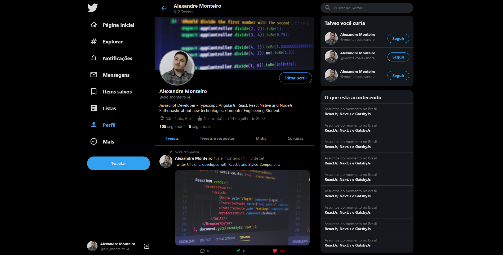

<h1>
  <a href="https://monteiro-alexandre-twitter-ui-clone.netlify.app/">
    Twitter UI Clone
  </a>
</h1>


[](https://opensource.org/licenses/MIT)

Twitter UI clone for study purposes.
<p>Deployed <a href="https://monteiro-alexandre-twitter-ui-clone.netlify.app/">here</a>.</p>

<p align="center">
  
</p>

## 💻 Technologies

This project was developed with the following technologies:

- [Typescript](https://www.typescriptlang.org/)
- [React](https://reactjs.org)
- [Styled Components](https://styled-components.com/)
- [Eslint](https://eslint.org/)
- [Commitlint](https://commitlint.js.org/#/)

## 📝 Getting started

First you need to have `node` and `yarn` installed on your machine. Then, you can clone this repository.

```bash
git clone https://github.com/monteiro-alexandre/twitter-ui-clone.git
```

Install dependencies:

```bash
yarn
```

After finishing the installation, run:

```bash
yarn start
```

To view the project you can open [localhost:3000](http://localhost:3000).

## License

This project is licensed under the MIT License - see the [LICENSE](LICENSE.md) file for details.